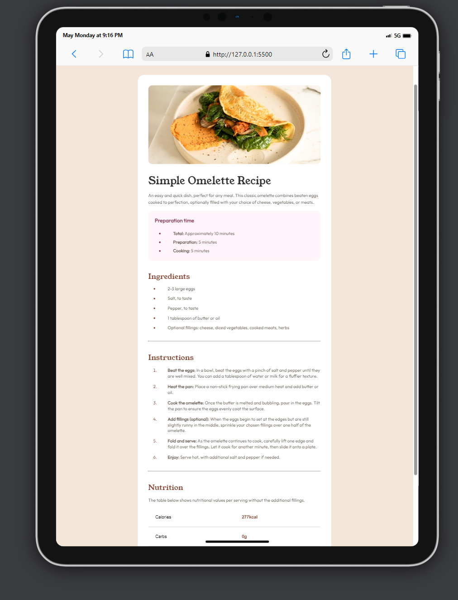

# Frontend Mentor - Recipe page solution

This is a solution to the [Recipe page challenge on Frontend Mentor](https://www.frontendmentor.io/challenges/recipe-page-KiTsR8QQKm). Frontend Mentor challenges help you improve your coding skills by building realistic projects.

## Table of contents

- [Screenshot](#screenshot)
  - [Links](#links)
  - [Built with](#built-with)
  - [What I learned](#what-i-learned)
  - [Continued development](#continued-development)
- [Author](#author)
- [Acknowledgments](#acknowledgments)

### Screenshot

### Links

- Solution URL: [Add solution URL here](https://your-solution-url.com)
- Live Site URL: [Add live site URL here](https://your-live-site-url.com)

### Built with

- Semantic HTML5 markup
- CSS custom properties
- Flexbox
- Mobile-first workflow

### What I learned

I learnt how to properly use the table element in html it was difficult at first but I got the hang of it

### Continued development

I will continue to develop my skills by working on more projects

## Author

- Frontend Mentor - [@andy.chuks51](https://www.frontendmentor.io/profile/andychuks51)
- Twitter - [@andy.chuks51](https://x.com/drew_techie?t=UtWIzwv2An_piRX-6OoeiA&s=09)

## Acknowledgments

I give almighty God the praise for giving me the opportunity to complete this challenge and I also appreciate Frontend Mentors for providing this opportunity for me to develop my skill... I say a million thank you. ❤️
